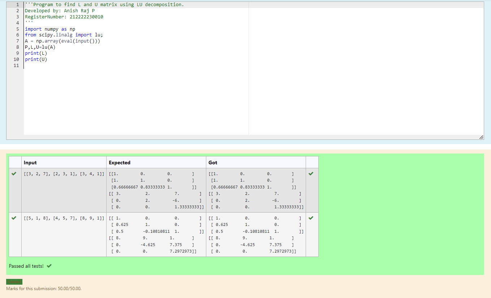
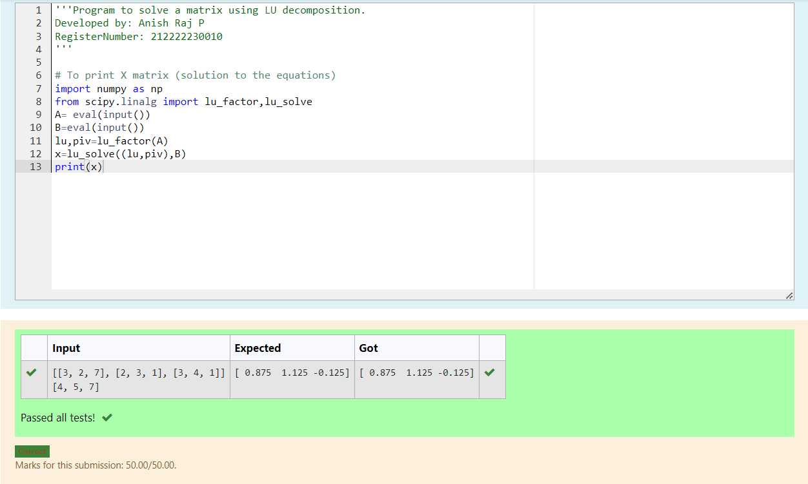

# LU Decomposition 

## AIM:
To write a program to find the LU Decomposition of a matrix.

## Equipments Required:
1. Hardware – PCs
2. Anaconda – Python 3.7 Installation / Moodle-Code Runner

## Algorithm
1. Import numpy library using import statement.
2. From scripy package import lu_factor() and lu_solve().
3. Get two inputs from user and pass it as matrix array.
4. Find lu and pivot value of first matrix using lu_factor().and Find solution of thematrix by using
lu_solve() by passing lu,pivot values as first argument and second matrix as second argument.


## Program:
(i) To find the L and U matrix
```
#Program to find L and U matrix using LU decomposition.
#Developed by: Anish Raj P
#RegisterNumber: 212222230010
import numpy as np
from scipy.linalg import lu;
A = np.array(eval(input()))
P,L,U=lu(A)
print(L)
print(U)
```
(ii) To find the LU Decomposition of a matrix
```
#Program to solve a matrix using LU decomposition.
#Developed by: Anish Raj P
#RegisterNumber: 212222230010
import numpy as np
from scipy.linalg import lu_factor,lu_solve
A= eval(input())
B=eval(input())
lu,piv=lu_factor(A)
x=lu_solve((lu,piv),B)
print(x)
```
## Output:

and



## Result:
Thus the program to find the LU Decomposition of a matrix is written and verified using python programming.

